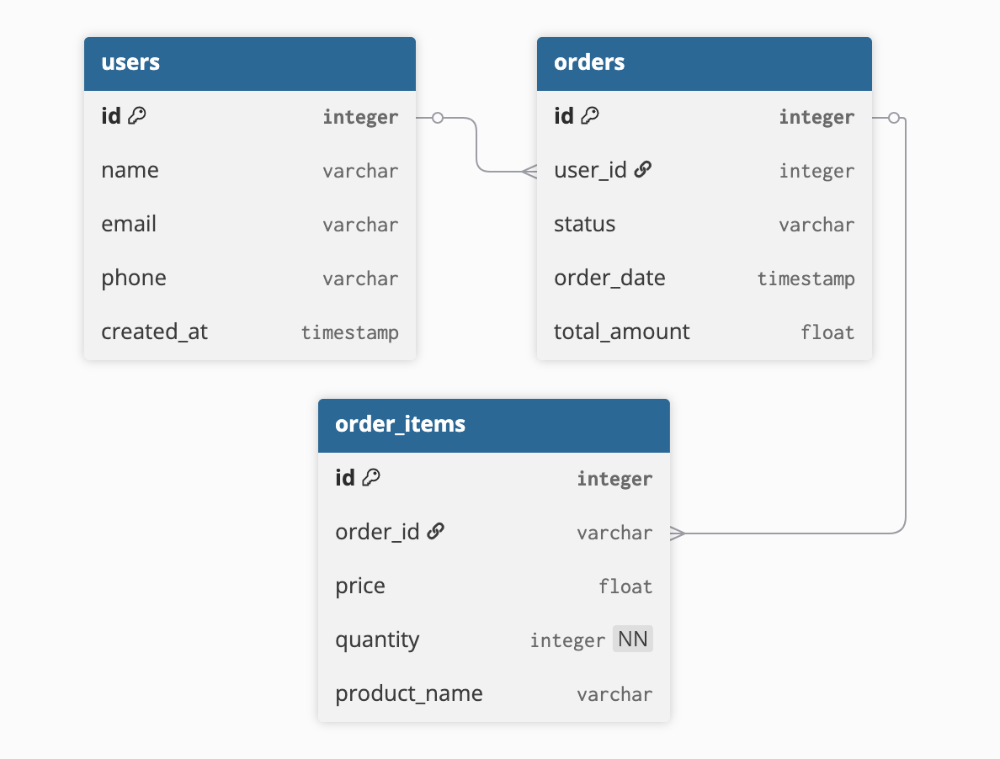

# Проект Управление заказами

# API Endpoints

## Users
### POST /users  
Создать пользователя  

### GET /users  
Получить список пользователей  

### GET /users/:id  
Получить пользователя по id  

### DELETE /users/:id  
Удалить пользователя  

---

## Orders
### POST /orders  
Создать заказ для пользователя  

### GET /orders  
Получить список заказов  

### GET /orders/:id  
Получить заказ по id (с позициями заказа)  

### PUT /orders/:id  
Обновить заказ (например, статус или сумму)  

### DELETE /orders/:id  
Удалить заказ  

---

## Order Items
### POST /orders/:order_id/items  
Добавить товар в заказ  

### GET /orders/:order_id/items  
Получить все товары в заказе  

### GET /orders/:order_id/items/:id  
Получить товар в заказе по id  

### PUT /orders/:order_id/items/:id  
Обновить товар в заказе (например, количество или цену)  

### DELETE /orders/:order_id/items/:id  
Удалить товар из заказа  